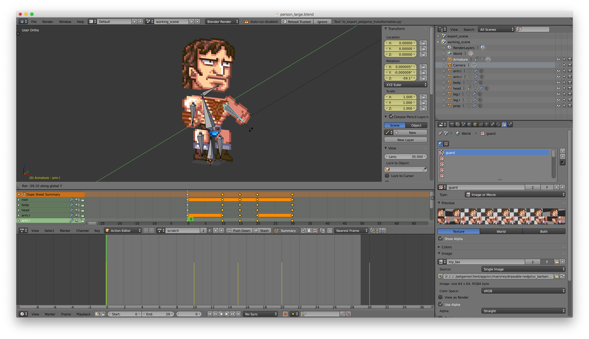
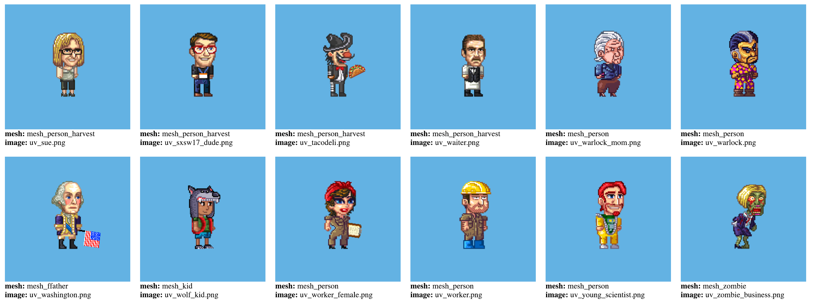

## Bitkin Live Blender Export Scripts

Or how to go from a Blender project file:

To raw vertices in my own format for rendering in whatever technology I chose:

This repository holds a collection of the python scripts used in the creation of [Bitkin Live](https://play.google.com/store/apps/details?id=net.josephharding.petgame.android&hl=en)

### :snake: Anaconda :snake:

I'm including this reposititory to show my understanding of the importance of tools and to provide more examples of python code I've written.

Note: I didn't include run instructions here as I thought installing Blender and getting a hold of raw project files from Bitkin Live might be a bit too much to ask, but my other two projects do run!
